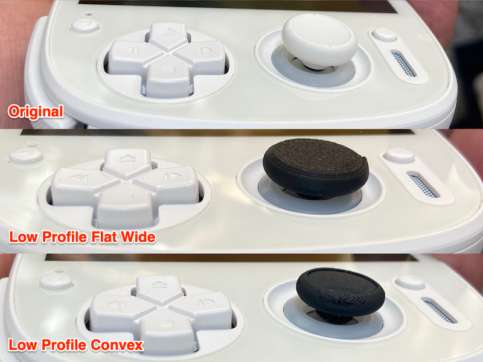

# Retroid Pocket 5 アナログスティックキャップ

[Retroid Pocket 5](https://www.goretroid.com/products/retroid-pocket-5-handheld) 用のアナログスティックキャップです。
オリジナルと交換して利用します。

※ おそらくAYN Odin 2、Anbernic RG406Hでも使えると思います。

私は [Bambu Lab A1 mini](https://us.store.bambulab.com/products/a1-mini) でプリントしています。

3Dプリンタをお持ちでない方のために、DMM.make 用の STL ファイルを用意しました。[stl/forDMMmake](stl/forDMMmake) のファイルをご利用ください。自分で発注してみた印象だと問題はないと思います。

- [rp5-low-convex8.stl](stl/forDMMmake/rp5-low-convex8.stl) … ロープロファイル・コンベックス 8 個組
- [rp5-low-convex4.stl](stl/forDMMmake/rp5-low-convex4.stl) … ロープロファイル・コンベックス 4 個組
- [rp5-low-flat4.stl](stl/forDMMmake/rp5-low-flat4.stl) … ロープロファイル・フラット 4 個組
- [rp5-low-flat-wide4.stl](stl/forDMMmake/rp5-low-flat-wide4.stl) … ロープロファイル・フラット・ワイド 4 個組
- [rp5-convex-std4low4.stl](stl/forDMMmake/rp5-convex-std4low4.stl) … コンベックスのスタンダード 4 個、ロープロファイル 4 個
- [rp5-low-flatwide4_convex4.stl](stl/forDMMmake/rp5-low-flatwide4_convex4.stl) … ロープロファイルのコンベックス 4 個、フラットワイド 4 個

## 必要なライブラリ

- [BOSL2](https://github.com/BelfrySCAD/BOSL2)

## ライセンス

ゼロ条項 BSD ライセンスです

## 関連サイト

MakerWorld: https://makerworld.com/en/models/1140934