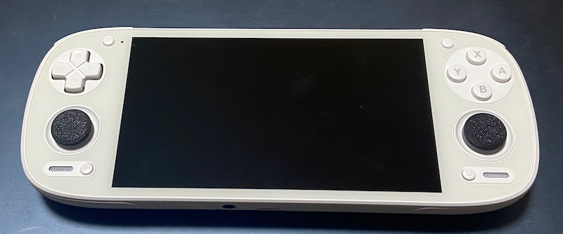
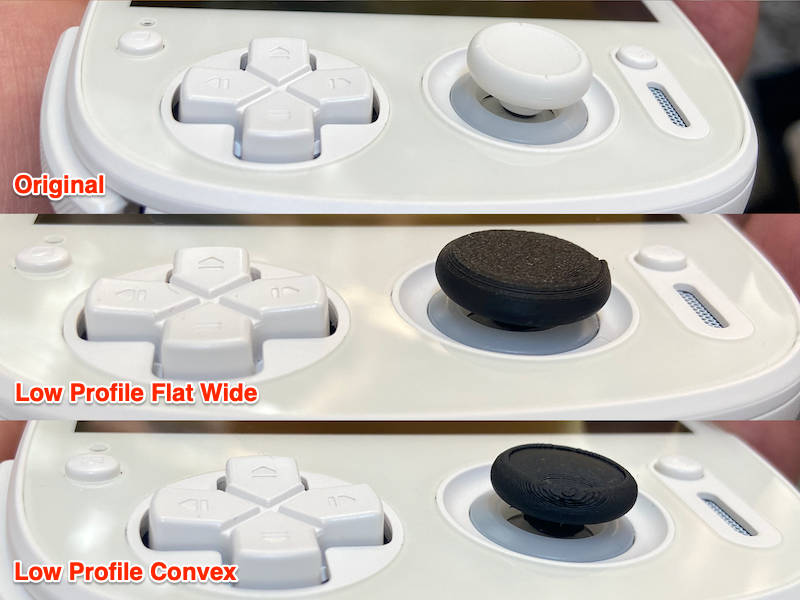
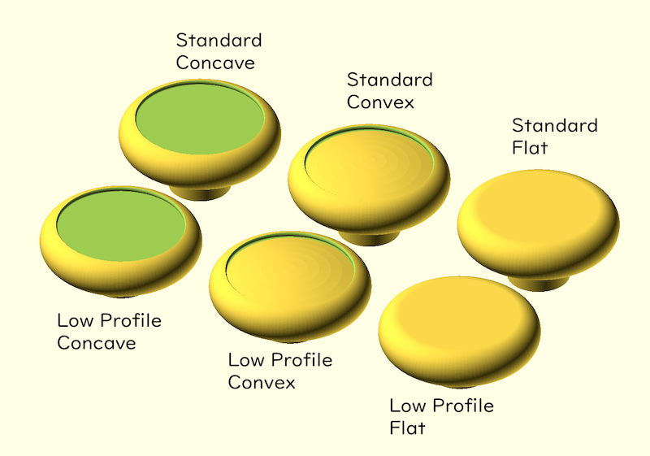
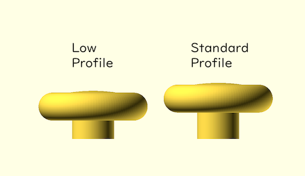
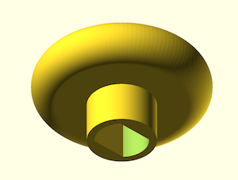

note from lexaone:
this is cloned version of https://github.com/higemaru/scad/blob/main/retroid-pocket5-stick/README.md
this thumb stick cap fits well on retroid pocket 4

# Retroid Pocket 5 thumb stick

Thumb Stick Cap for [Retroid Pocket 5](https://www.goretroid.com/products/retroid-pocket-5-handheld) (Replace the original parts).

\# Probably works for AYN Odin 2,  Anbernic RG406H as well.

I print by [Bambu Lab A1 mini](https://us.store.bambulab.com/products/a1-mini) 3D Printer.

## REQUIREMENT

- [BOSL2](https://github.com/BelfrySCAD/BOSL2)

## LICENSE

Zero-Clause BSD LICENSE

## SEE ALSO

MakerWorld: https://makerworld.com/en/models/1140934

